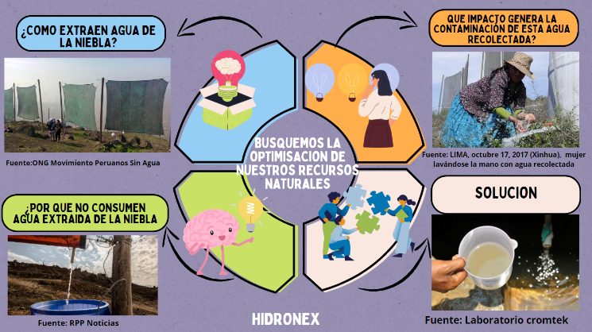
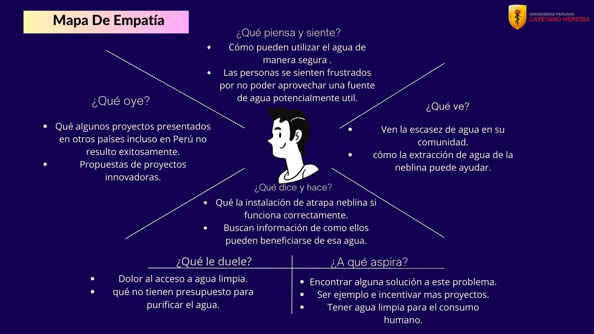
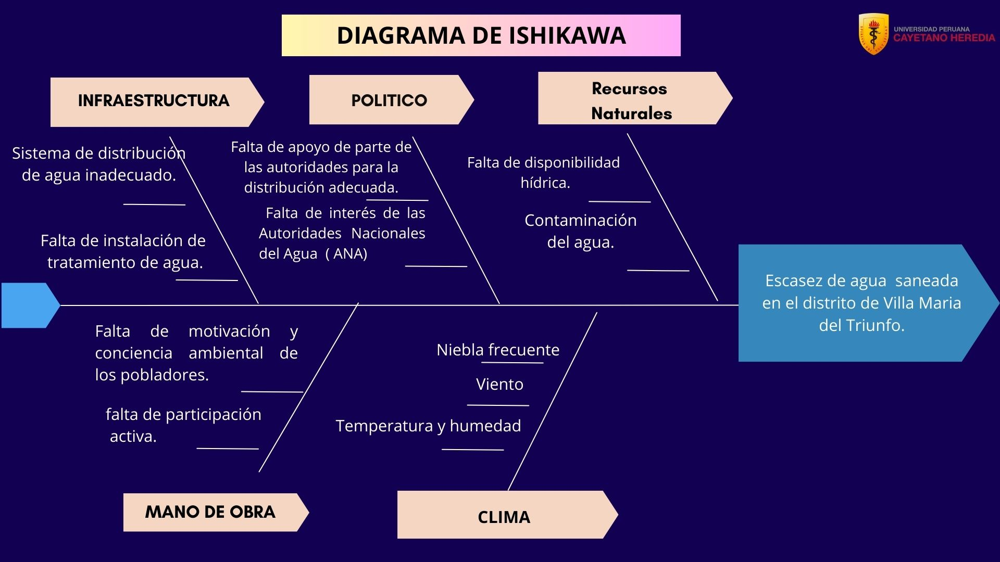

# PROBLEMÁTICA: ODS 6 "AGUA LIMPIA Y SANEAMIENTO"

## PROBLEMÁTICA:

La captación de agua de niebla en las Lomas de Villa María del Triunfo enfrenta una problemática significativa en cuanto a la calidad del agua recolectada. A pesar de los esfuerzos para aprovechar este recurso mediante la recolección con mallas, los valores de conductividad, turbidez y la presencia de coliformes fecales hacen que el agua captada no sea apta para el uso de las personas, en el lugar hay poco conocimiento sobre los valores de turbidez por lo que los beneficios de recolectar esta agua solo beneficia a la flora y fauna. Este desafío subraya la necesidad urgente de una solución integral para asegurar la disponibilidad y el acceso de agua potable.

**Fuente:** (Elaboración propia, 2024)

## MAPA DE EMPATÍA:

## DIAGRAMA DE ISHIKAWA:

## JOURNEY MAP:

## PROPUESTA DE SOLUCIÓN: 

Frente a la problemática planteada, se propone la implementación de un sistema avanzado basado en sensores y tecnología de automatización. Se utilizarán sensores de turbidez y otros dispositivos conectados a un sistema centralizado controlado por Arduino. Este sistema no sólo medirá los parámetros de turbidez, Ph y la presencia de coliformes del agua recolectada, sino que también  dirigirá y gestionará de manera inteligente su destino con la ayuda de una plataforma web, de esta manera promueve la sostenibilidad y el equilibrio ecológico en las Lomas de Villa María del Triunfo.
