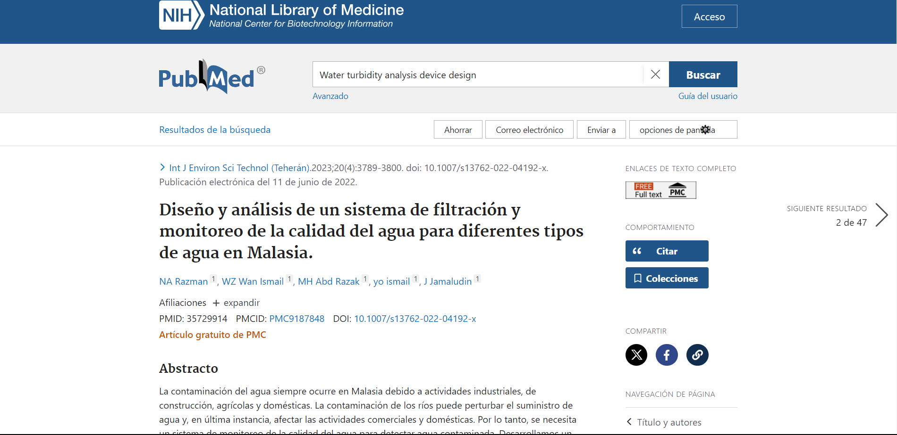
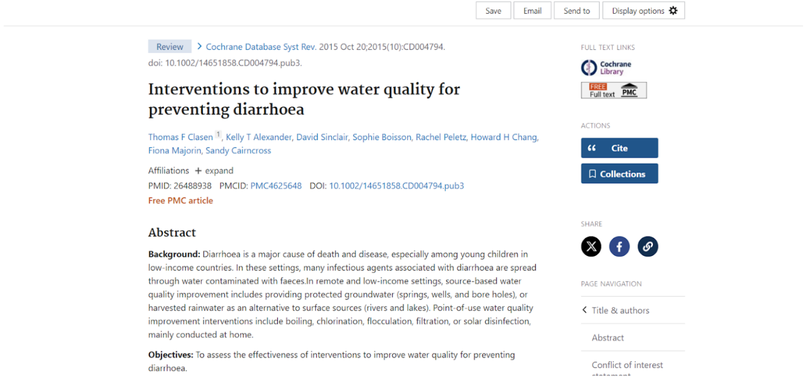
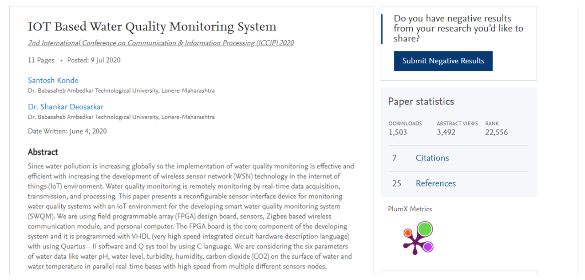
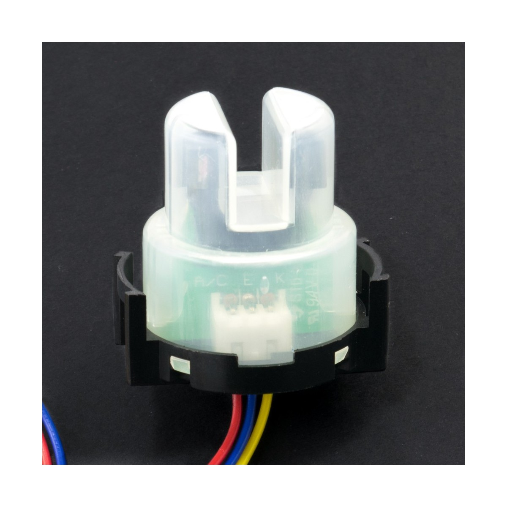
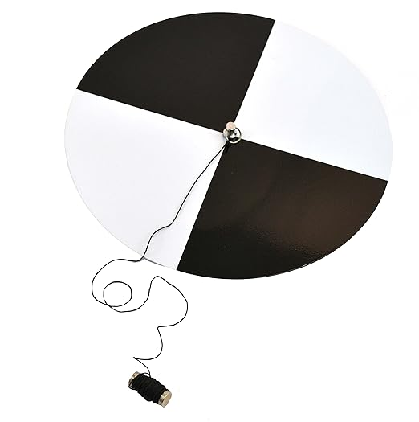
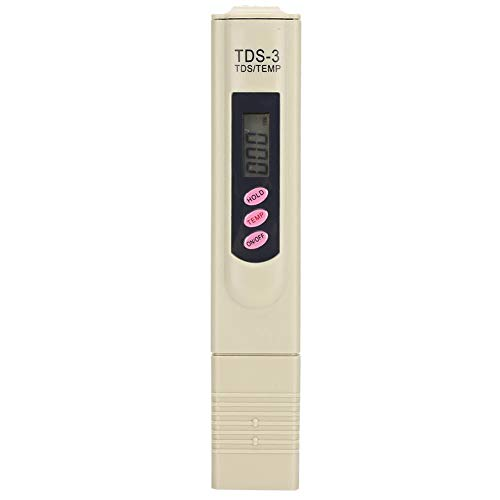

# Estado del Arte

## 💡 Contexto Científico

### 📚 Artículos Originales (3)
| #   | Título del Artículo                 | Detalles                                      | Enlace                                 |
| --- | ----------------------------------- | --------------------------------------------- | ---------------------------------------|
| 1   | Diseño Innovador                    | [Aquí](#diseno-innovador)                     | [Enlace al Artículo 1](https://pubmed.ncbi.nlm.nih.gov/35729914/) |
| 2   | Ensayos Clínicos                    | [Aquí](#ensayos-clinicos)                     | [Enlace al Artículo](https://doi.org/10.1002/14651858.CD004794.pub3)[Enlace del Articulo 2](https://doi.org/10.3390/ECWS-7-14326) |
| 3   | Revisiones Sistemáticas             | [Aquí](#revisiones-sistematicas)              | [Enlace al Artículo 3](https://doi.org/10.2139/ssrn.3645467) |

## Diseño Innovador 

##  Diseño y análisis de un sistema de filtración y monitoreo de la calidad del agua para diferentes tipos de agua en Malasia.

Este artículo describe un proyecto destinado a abordar la contaminación del agua en Malasia mediante el desarrollo de un sistema de monitoreo y filtración de la calidad del agua controlado por Arduino. Se enfoca en la detección temprana de agua contaminada, especialmente en ríos, debido a actividades industriales, de construcción, agrícolas y domésticas.
El sistema, diseñado en Proteus y utilizando ThingSpeak para el monitoreo en tiempo real, mide parámetros como pH, temperatura, turbidez, conductividad eléctrica y potencial de oxidación-reducción. Si se detecta una calidad del agua insatisfactoria, la muestra se filtra a través del sistema de filtración. (Razman et al., 2023).

## Ensayos Clínicos 

## Intervenciones para mejorar la calidad del agua para prevenir la diarrea.

En este presente artículo se habla sobre la diarrea como una de las  problemáticas  graves especialmente en los países de bajos ingresos económicos, donde pueden provocar enfermedades incluso la muerte, especialmente en los niños. Muchos agentes infecciosos que causan diarrea se transmiten a través del agua contaminada en zonas remotas y empobrecidas, donde se pueden tomar medidas para mejorar la calidad del agua. Estas incluyen el uso de agua subterráneas o agua de lluvia recolectada en lugar de fuentes superficiales. También se puede llevar a cabo medidas de mejora de la calidad de agua en el punto de uso, como hervirla, clorarla, filtrar o desinfectarla. Estos procedimientos se realizan principalmente en los hogares (Clasen et al., 2015).

## Estimación de la turbidez del agua en el tratamiento de agua potable Plantas que utilizan aprendizaje automático basado en agua y Datos Meteorológicos.

Ese proyecto instaló sensores para evaluar la turbidez en algunas plantas de zonas rurales del departamento de cauca, además determinaron algoritmos que fueran capaz de estimar aceptablemente la turbidez del agua y que a la vez les sirviera de apoyo a los operadores en la toma de decisiones para la aplicación de un tratamiento adecuado al agua potable, pero estos sensores fueron retirados al finalizar el proyecto por lo que fue necesario crear nuevos modelos de aprendizaje automático para predecir los valores de turbidez sin sensores considerando únicamente los datos de pH, temperatura, presión de vapor y precipitación capturado manualmente por los operadores de las plantas, del  cual el punto más interesante fue el análisis exploratorio de datos, donde se aplicó la siguiente ecuación para calcular la transformación logarítmica de la variable de turbidez del agua. log turbidez = log (turbidez + 1). (Fernandez Alvarez et al., 2023).

## Revisiones Sistemáticas 

## Sistema de monitoreo de calidad del agua basado en IOT.

Este artículo describe un dispositivo de interfaz de sensor reconfigurable para la monitorización de la calidad del agua con el entorno Iot para el desarrollo de un sistema inteligente de monitorización de la calidad del agua, de los cuales los parámetros que más me interesaron fueron el sensor de turbidez, que tiene la finalidad de detectar la calidad del agua midiendo el nivel de turbidez, así como la detección de partículas  en suspensión mediante la medición de la transmitancia de luz y los modos de salida de señal analógica y digital y también otro de los parámetro interesantes es el sensor de PH, que tiene la función de detectar el valor del PH de agua. Estas variables propuestas pueden ayudar a proteger el entorno ecológico de los recursos hídricos así como minimizar el tiempo y los costos en la detección de la calidad del agua de un embalse como parte de la gestión medioambiental. (Konde & Deosarkar, 2020).

## 🌐 Contexto Comercial

### 🚀 Equipos o Dispositivos en el Mercado (3)
| #   | Producto                                          | Descripción                                                                                                                                                                                            | Precio   | Características                                                                                                      | Imagen Referencial                                                                                                                                                  | Enlace                                               |
| --- | -------------------------------------------------- | ------------------------------------------------------------------------------------------------------------------------------------------------------------------------------------------------------ | -------- | -------------------------------------------------------------------------------------------------------------------- | ------------------------------------------------------------------------------------------------------------------------------------------------------------------ | ---------------------------------------------------- |
| 1   | Sensor de turbidez de agua                        | El sensor de turbidez de agua permite medir de forma sencilla la calidad de agua midiendo la turbidez del agua. Integra un diodo infrarrojo y un fototransistor posicionados uno frente al otro.              | $665.96  | Voltaje de alimentación: 5V DC Corriente de operación: 40 mA máximo. Temperatura de operación: 5 ℃ ~ 90 ℃. Salida analógica(0-4.5V) y digital TTL 4 Pines de conexión: G: GND, A: Salida Analógica, D: Salida Digital, V:VCC | [Sensor de turbidez]                        | [Ver producto](https://naylampmechatronics.com/sensores-liquido/535-sensor-de-turbiedad-de-agua.html)   | 
| 2   | Disco de Secchi para determinar la Turbidez       | Disco de Secchi de 20 cm de diámetro. - Utilizado desde el lado de sotavento de un barco o muelle entre media mañana y media tarde. - Marca: Cole-Parmer™ 05492-00. - Peso: 0.74700kg.          | $665.96  | Disco de Secchi de 20 cm de diámetro. Utilizado desde el lado de sotavento de un barco o muelle entre media mañana y media tarde. Marca: Cole-Parmer™ 05492-00. Peso: 0.74700kg.     | ![Disco de Secchi]          | [Ver producto](https://www.amazon.com.mx/Secchi-Disc-including-Holding-String/dp/B0160A1UUM/ref=sr_1_2?adgrpid=1163283868021112&dib=eyJ2IjoiMSJ9.pcV_ZueSuiMHg4HsMGDh4HgMytwuQzUD4cWOYicsWX9IcNyoDmiSASAVzhsfyP3EbNzxQplAN0awYHWyy3ZLnd_bA1I1vDrY3364afRHzjoF30aFLRfh76hP4Tq-HHi8fLhNuhA7BbhUf35aSZo6Kg.owP9-XsozNp5cLaZDz6faVysqDFHxv6UcPgrCGxWmBE&dib_tag=se&hvadid=72705477365012&hvbmt=bp&hvdev=c&hvlocphy=145622&hvnetw=s&hvqmt=p&hvtargid=kwd-72705703086918%3Aloc-148&hydadcr=11030_13498897&keywords=disco+secchi&qid=1705617955&sr=8-2&ufe=app_do%3Aamzn1.fos.4e545b5e-1d45-498b-8193-a253464ffa47)                   |
| 3   | Probador de agua digital del medidor TDS         | Pantalla LCD grande. - Función de apagado automático después de 10 minutos sin operación. - Sonda de aleación de titanio para medir el agua con alta precisión. - Modelo de producto: LR44. | $230.00  | Pantalla LCD grande. Función de apagado automático después de 10 minutos sin operación. Sonda de aleación de titanio para medir el agua con alta precisión. Modelo de producto: LR44. | ![Probador de agua digital]           | [Ver producto](https://equipo-laboratorio.com/laboratorio/turbidimetros/)   |

### 🛡️ Patentes (3)
| #   | Patente                          | Enlace                                 |
| --- | ---------------------------------| -------------------------------------- |
| 1   | Patente 1                        | [Enlace a la Patente 1](https://www.engineeringforchange.org/solutions/product/aqualonis-cloudfisher/) |
| 2   | Patente 2                        | [Enlace a la Patente 2](URL_Patente_2) |
| 3   | Patente 3                        | [Enlace a la Patente 3](https://patents.google.com/patent/ES2946044A1/es) |

## PATENTE N°1:

WO2016062877A1 - Aqualonis CloudFisher 

**Inventor**: Pedro Trautwein

**Fecha de publicación**: 28/04/2016

**País de publicación**: Alemania

**Resumen**:
Es un colector de niebla que recoge la bruma del aire cuando sopla en las redes de malla 3D del Cloud Fisher y recoge el agua condensada en un recipiente para su uso en ubicaciones costeras adecuadas. Este producto fue desarrollado originalmente por Wasser Stiftung y comercializado por Aqualonis, además este producto está disponible en tres tamaños diferentes para satisfacer diferentes necesidades de recolección de agua, así como un modelo de prueba. (Aqualonis CloudFisher, s. f.)

  

### Descripción de componentes:
- Marco de metal con expansores de goma
- Malla de captación de poliéster flexible 
4 marcos de malla de 13,5m2
- Hormigón
- Redes de telas tejidas mono-fibras en 3D
- Anclaje y cuerda
  
Es el primer colector de niebla que puede soportar altas velocidades de viento de hasta 120 km/h. Es rápido y fácil de instalar, no requiere energía y requiere muy poco mantenimiento. Todos los materiales utilizados son aptos para alimentos. Gracias a su rendimiento, Cloud Fisher garantiza a innumerables personas agua potable de alta calidad que cumple con los estándares de la OMS a bajo costo.

- ¿Dónde se pueden instalar los “atrapanieblas”?
  
Las posibles áreas de aplicación del Cloud Fisher son regiones montañosas y costeras secas con mucha niebla y viento, como Etiopía, Australia, Chile, Eritrea, Irán, Colombia, Marruecos, Namibia, Nepal, América del Norte, Omán, Perú, España. Sudáfrica, Tanzania o Yemen.

- ¿Qué tan productivos son los captadores de niebla Cloud Fisher?
Dependiendo de la región y la estación, el rendimiento diario de agua oscila entre 6 y 22 litros por metro cuadrado neto.

## PATENTE N°3: 

**ES2946044A1**

**Inventores:** Pons Ariño Angel

**Fecha de publicación:** 2023-12-07

**País de publicación:** España

**Resumen:**
El dispositivo es un toma de muestra de aguas residuales que se extrae y filtra agua residual de manera automática, por ello se emplea equipos hidráulicos y un cartucho filtrante que recircula el agua recogida por un depósito hasta obtener un volumen de agua con una concentración determinada para realizar posteriormente en análisis vírico de la muestra filtrada mediante ensayo qRT-PCR.

**Descripción de componentes:**
- Dispositivo portátil de toma de muestras de aguas residuales.
- El depósito es realizado por impresión 3D.
- Una bomba hidráulica situada en el colector y el depósito.
- Un equipo de filtrado que está asociado al depósito y que también está conectado con el colector.
- Un equipo de toma de muestras, asociado a la cámara secundaria del depósito.
- Un equipo de limpieza, formado, principalmente, por al menos una bomba de limpieza.

  

# Lista de Requerimientos

| Requerimientos Funcionales ✔️                 | Requerimientos No Funcionales ⚙️              |
| ---------------------------------------------| ---------------------------------------------|
| **Sensores de turbidez:** El sistema debe ser capaz de clasificar los niveles de turbidez en categorías como alto, bajo y apto para el consumo humano.El sistema debe ser capaz de clasificar los niveles de turbidez en categorías como alto, bajo y apto para el consumo humano.| **Fiabilidad:** El sistema debe ser altamente confiable, asegurando mediciones precisas y acciones correctas en todo momento.|
| **Un mecanismo, controlado por Arduino, para dirigir el flujo de agua:** Para dirigir el flujo de agua hacia tanques específicos según el nivel de turbidez detectado. | **Escalabilidad:** La arquitectura del sistema debe ser escalable para permitir futuras expansiones o mejoras.  |
| **Redirección Automática:** El sistema debe ser capaz de redirigir automáticamente el agua recolectada hacia un tanque adecuado para su uso (riego, consumo humano) según los resultados de la medición de turbidez.    | **Adaptabilidad:** El sistema debe ser capaz de adaptarse a cambios en las condiciones ambientales y de agua.  |
| **Eficiencia Energética:** El sistema debe ser eficiente en cuanto al consumo de energía para garantizar un funcionamiento sostenible, considerando la disponibilidad de energía en la ubicación.  | **Sostenibilidad:** El sistema debe ser diseñado para ser respetuoso con el medio ambiente y sostenible en términos de recursos y energía.|
| **Almacenamiento de Datos:** Implementar un sistema de almacenamiento de datos para registrar históricos de las mediciones de turbidez y la asignación de agua a lo largo del tiempo.    | **Accesibilidad:** La página web debe ser accesible desde diferentes dispositivos y navegadores para facilitar el acceso a la información a los usuarios. |
| **Notificaciones:** El sistema debe ser capaz de enviar notificaciones, ya sea por la página web o por otros medios, para informar a los usuarios sobre cambios significativos o problemas en el sistema.    | **Mantenimiento:** El sistema debe ser de fácil mantenimiento, con la capacidad de realizar actualizaciones y correcciones de manera eficiente.
**Interfaz de Usuario Intuitiva:** La interfaz de usuario en la página web debe ser intuitiva y fácil de entender para que los habitantes del lugar puedan verificar el estado del agua y las acciones realizadas.    |   **Compatibilidad con Energía Renovable:** Evaluar la posibilidad de utilizar energía renovable, como paneles solares, para alimentar el sistema y garantizar su funcionamiento continuo.

# BIBLIOGRAFÍA:

Aqualonis CloudFisher. (s. f.). Engineering For Change. Recuperado 18 de enero de 2024, de 2. https://www.engineeringforchange.org/solutions/product/aqualonis-cloudfisher/

Clark, J. E. (2019). Multi-Parameter Water Analysis System with Analysis Application Updateable via a Cloud-Based Data Resource (United States Patent US20190003976A1). 
https://patents.google.com/patent/US20190003976A1/en?q=(IoT+water+quality+analysis+system+patent)&oq=IoT+water+quality+analysis+system+patent

Clasen, T. F., Alexander, K. T., Sinclair, D., Boisson, S., Peletz, R., Chang, H. H., Majorin, F., & Cairncross, S. (2015). Interventions to improve water quality for preventing diarrhoea. The Cochrane Database of Systematic Reviews, 2015(10), CD004794.
https://doi.org/10.1002/14651858.CD004794.pub3

Cole-Parmer&trade;&nbsp;Disco de Secchi para determinar la Turbidez Lamotte&trade;—Muestreadores de agua y aguas residuales Muestreadores. (s. f.). Recuperado 18 de enero de 2024, de 
https://www.fishersci.es/shop/products/turbidity-disk/11762373

Fernandez Alvarez, V., Granada Salazar, D., Figueroa, C., Corrales, J. C., & Casanova, J. F. (2023). Estimation of Water Turbidity in Drinking Water Treatment Plants Using Machine Learning Based on Water and Meteorological Data. Environmental Sciences Proceedings, 25(1), Article 1.
https://doi.org/10.3390/ECWS-7-14326

Konde, S., & Deosarkar, D. S. (2020). IOT Based Water Quality Monitoring System (SSRN Scholarly Paper 3645467).
https://doi.org/10.2139/ssrn.3645467

Probador de agua digital del medidor TDS, Probador preciso de la calidad del agua Pluma de prueba de calidad del agua con sonda de aleación Alta precisión para acuarios, hidroponía, vino, spas(Beige): Amazon.com.mx: Industria, Empresas y Ciencia. (s. f.). Recuperado 18 de enero de 2024, de 
https://www.amazon.com.mx/dp/B08FXBWRS7/?tag=quimico-lab-20

Razman, N. A., Wan Ismail, W. Z., Abd Razak, M. H., Ismail, I., & Jamaludin, J. (2023). Design and analysis of water quality monitoring and filtration system for different types of water in Malaysia. International Journal of Environmental Science and Technology: IJEST, 20(4), 3789-3800. 
https://doi.org/10.1007/s13762-022-04192-x

Sensor de turbidez de agua. (s. f.). Naylamp Mechatronics - Perú. Recuperado 18 de enero de 2024, de https://naylampmechatronics.com/sensores-liquido/535-sensor-de-turbiedad-de-agua.html

