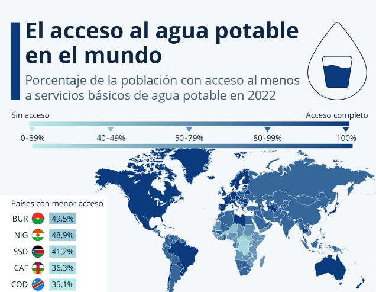
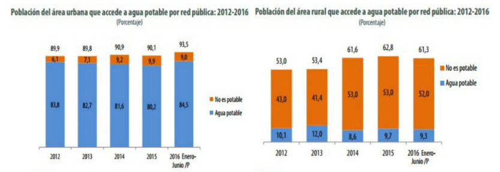
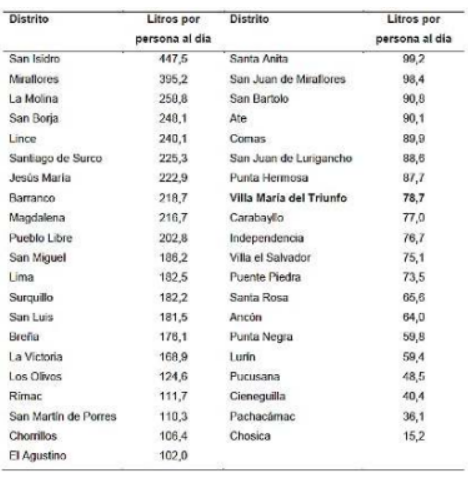
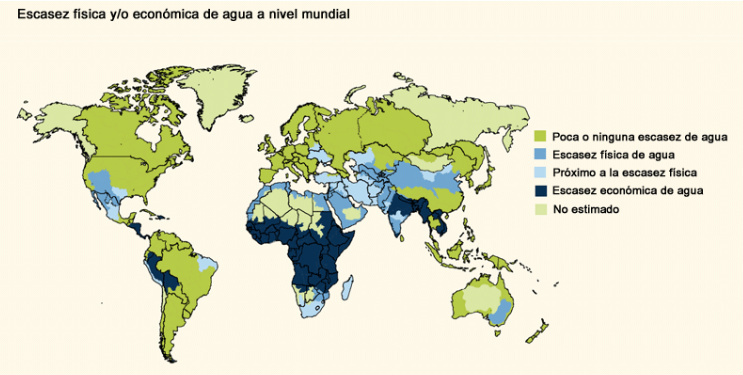
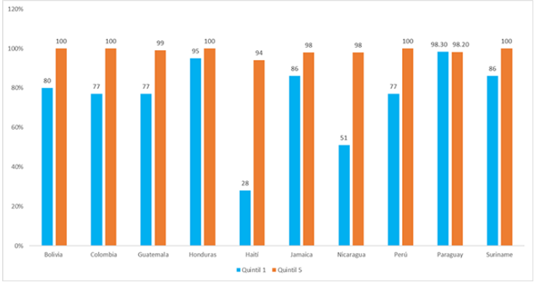

# CONTEXTO SOCIAL

## A NIVEL MUNDIAL

A lo largo de los años, la escasez de agua potable se ha incrementado considerablemente debido al crecimiento de la población a nivel mundial. Según el Banco Mundial (BIRF):

> "Alrededor de 2000 millones de personas en todo el mundo no tienen acceso a servicios de agua potable gestionados de manera segura, 3600 millones no cuentan con servicios de saneamiento seguros y 2300 millones carecen de instalaciones básicas para lavarse las manos" (BIRF-AIR, 2023) (Agua, s. f.).

La escasez de agua potable se ha incrementado en los últimos años debido al aumento de la población, los efectos del cambio climático a nivel mundial y el uso excesivo e irracional del agua (UNESCO, 2015). Esta problemática representa un desafío acuciante para el desarrollo socioeconómico y humano a nivel global. La escasez de agua puede empeorar debido al cambio climático, especialmente en zonas áridas y semiáridas que ya presentan estrés hídrico (ONU, 2005).

**Fuente:** Programa de Monitoreo OMS/UNICEF, 2023 (Infografía, 2023)

Como se observa en el gráfico, los cinco países con menor cobertura básica de este servicio se encuentran en dicha región, con la República Democrática del Congo en último lugar con un 35% de sus habitantes con acceso al preciado líquido. Cabe destacar que, a pesar de que gran parte de los países superan el 90% en acceso básico al agua potable, la mayoría de estos se encuentran en la lucha constante por abastecer a sus pobladores con escasos recursos renovables de agua (OMS/UNICEF, 2023).

## A NIVEL NACIONAL

Según el ranking de estrés hídrico, Perú se encuentra en el puesto 66 con un nivel medio-alto de escasez de agua potable. Se proyecta que para el 2024, el 58% de los peruanos vivirán en zonas con escasez de agua dulce debido a la crisis global por el agua. Esto posiciona a Perú como uno de los países más afectados en América Latina y el Caribe, según informó el Centro Nacional de Planeamiento Estratégico (Ceplan, 2023).

**Fuente:** Instituto Nacional de Estadística e Informática-Encuestas Nacional de Hogares.

En nuestro país, la zona urbana es la que consume en mayor proporción agua potable. Al primer semestre del 2016, el 84,5% usa este recurso a través de una red pública y el 9,0% agua no potable. En cambio, el 61,3% de la población del área rural accede a agua potable por una red pública, aunque en su mayoría no es potable (SERVINDI, 2017). Además, en octubre de 2022, las localidades del sur de Cusco y centro-sur de Puno fueron consideradas como las zonas más secas de los últimos 58 años, afectadas principalmente por el fenómeno de La Niña (SENAMHI, 2022). La crisis del agua en Perú es una problemática preocupante que requiere medidas de solución.

## A NIVEL REGIONAL

En nuestro país, los servicios de saneamiento y agua son inadmisibles, especialmente en la región de Lima metropolitana, debido a inversión insuficiente, falta de apoyo estatal, normas legales inadecuadas y graves problemas económicos de los operadores (Ministerio de Vivienda Construcción y Saneamiento [MVCS], 2016). Se estima que una persona debe consumir alrededor de 100 litros de agua al día para satisfacer sus necesidades tanto de consumo como de higiene, según la Organización Mundial de la Salud. Sin embargo, en Lima se consume en promedio hasta 250 litros de agua por persona (AQUAFONDO, 2017).

### Tabla 1. Consumo promedio de agua potable por distritos

Fuente: SEDAPAL, 2016

En la tabla 1 se puede apreciar que el consumo de agua de 21 distritos de Lima Metropolitana está por encima de lo establecido por la OMS (100 litros por persona al día), mientras que 20 distritos están por debajo del consumo de agua establecido por la OMS. Además, se puede observar que el distrito con mayor consumo de agua es San Isidro, mientras que el distrito con menor consumo de agua es Chosica, con menos del 20% de lo establecido por la OMS. El distrito de Villa María del Triunfo, donde se realiza el presente trabajo, está por debajo de lo establecido por la OMS, con un consumo de 78,7 litros por persona al día. Actualmente, en este distrito existe estrés hídrico, y los más afectados son los habitantes de zonas de bajos recursos económicos. A pesar de esto, el distrito ha implementado el sistema de atrapanieblas en diferentes zonas para contribuir al suministro de agua y aliviar el estrés hídrico (Condori Albornoz, 2019).

# CONTEXTO ECONÓMICO

## NIVEL MUNDIAL

El agua es imprescindible para el desarrollo y el crecimiento de la economía, y la falta de este líquido vital afecta a todos los sectores, incluyendo la agricultura y la ganadería (Agua, s. f.). El cambio climático, el crecimiento demográfico y los cambios económicos hacen que este recurso hídrico sea más valioso. En varios países, la escasez de agua ha limitado el desarrollo económico, perjudicando especialmente a personas de bajos recursos (Abastecimiento de agua, s. f.).

El agua es un recurso imparcial en todo el mundo, y se necesita la colaboración entre países para el cuidado de este líquido vital. El Banco Mundial trabaja con las personas para crear instituciones, medios de fomentación y brindar información para gestionar los recursos hídricos entre países. Las fuentes de suministro con una correcta administración benefician a los países (Agua, s. f.).

**Fuente:** Decenio Internacional para la Acción «El agua, fuente de vida» 2005-2015. Áreas temáticas: Escasez de agua.

## NIVEL REGIONAL

Según el Programa Conjunto de Monitoreo (JMP) de Abastecimiento de Agua y Saneamiento de la OMS/UNICEF de 2020, 161 millones de personas en América Latina (25% de la población) no tienen acceso a agua potable. Esto indica que los esfuerzos en la región son insuficientes para alcanzar el acceso a servicios de agua potable y saneamiento gestionados de forma segura (El agua como factor económico y los retos de América Latina – DW – 22/03/2023, s. f.).

En la región, 161 millones de personas (equivalente a 2,5 de cada 10 personas) no tienen acceso adecuado a agua potable (gestionada de manera segura) (Caribe, 2022).

**Fuente:** Programa Conjunto OMS/UNICEF de Monitoreo del Abastecimiento de Agua, Higiene y Saneamiento (2022).

Para el crecimiento económico, es fundamental este recurso. El agua es un componente vital para la producción y mantener los sectores económicos, por lo cual la reducción de las reservas de agua puede generar una desaceleración del crecimiento de la economía. En algunas regiones, las tasas de crecimiento podrían decrecer hasta en un 6% del producto interno bruto (PIB) para el año 2050 a consecuencia del mal manejo del agua en el ámbito de la agricultura, la salud, los ingresos y la propiedad, lo que llevaría a un crecimiento negativo sostenido (Staff, 2023). Superar la escasez de cobertura y mejorar la calidad de los servicios de agua potable y saneamiento de los países de América Latina requiere inversiones importantes para el crecimiento económico, fomentando la inversión en infraestructuras que distribuyan el agua de manera eficiente y limpia.

## NIVEL NACIONAL

De acuerdo con la Autoridad Nacional del Agua (ANA), muchos factores ambientales causan un déficit hídrico en Perú, siendo el principal la variación en la temporada de lluvias, en el contexto del cambio climático que vivimos (Atención del déficit hídrico, s. f.). En nuestro país, se vinculan directamente con los fenómenos El Niño y La Niña, los cuales afectan directamente a la producción de bienes y servicios, reduciendo el Producto Bruto Interno (PBI). Esto genera un impacto en varias regiones de nuestro país. Se necesita incrementar las inversiones para la construcción de infraestructuras que ayuden a gestionar agua limpia, ya que las inversiones actuales no son suficientes para lograr este objetivo.

## REFERENCIAS BIBLIOGRÁFICAS

- Abastecimiento de agua. (s. f.). [World Bank](https://www.bancomundial.org/es/topic/watersupply).
- Agua: Panorama general. (s. f.). [World Bank](https://www.bancomundial.org/es/topic/water/overview).
- Atención del déficit hídrico. (s. f.). [El Peruano](https://elperuano.pe/noticia/223684-atencion-del-deficit-hidrico).
- Caribe, C. E. para A. L. y el. (2022, septiembre). [Comisión Económica para América Latina y el Caribe](https://www.cepal.org/es/enfoques/servicios-basicos-agua-potable-electricidad-como-sectores-clave-la-recuperacion).
- Condori Albornoz, Y. Y. (2019). [Repositorio Universidad Nacional Tecnológica del Cono Sur de Lima](https://repositorio.untels.edu.pe/jspui/handle/123456789/566).
- El agua como factor económico y los retos de América Latina – DW – 22/03/2023. (s. f.). [DW](https://www.dw.com/es/el-agua-como-factor-econ%C3%B3mico-y-los-retos-de-am%C3%A9rica-latina/a-65073074).
- Fernández Calvo, L. (2017, diciembre 23). [El Comercio](https://elcomercio.pe/peru/conoce-proyecto-mallas-atrapanieblas-premiado-google-noticia-483882-noticia/?ref=ecr).
- [Google Plus](https://plus.google.com/+UNESCO). (2015, diciembre 11). [UNESCO](https://es.unesco.org/themes/garantizar-suministro-agua/hidrologia/escasez-calidad).
- Infografía: El acceso al agua potable en el mundo. (2023, agosto 24). [Statista Daily Data](https://es.statista.com/grafico/30663/porcentaje-de-la-poblacion-con-acceso-al-menos-a-servicios-basicos-de-agua-potable).
- Staff, I. (2023, febrero 8). [IMCO](https://imco.org.mx/situacion-del-agua-en-mexico).

