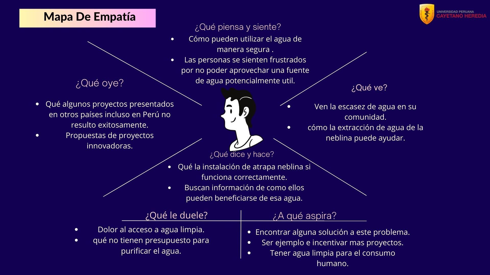
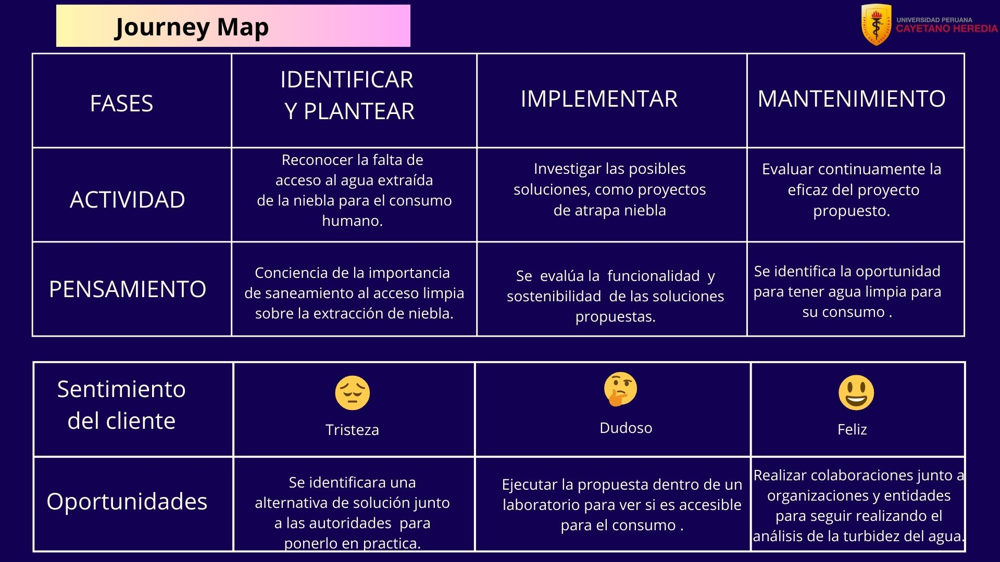

# PROBLEMÁTICA: ODS 6 "AGUA LIMPIA Y SANEAMIENTO"

## PROBLEMÁTICA:

En las Lomas de Villa María del Triunfo, la captación de agua de niebla a través de mallas enfrenta una problemática crucial debido a la calidad del agua recolectada. A pesar de los intentos de aprovechamiento, la presencia de  turbidez y el nivel desequilibrado de pH como tambien la conductividad electrica hacen que el agua no sea segura para el uso cotidiano de las personas. La falta de conocimiento sobre los niveles de turbidez limita los beneficios de esta recolección, lo cual solo beneficia a la flora y fauna, mientras que la comunidad carece de acceso a agua potable. 

**Fuente:** (Elaboración propia, 2024)

## MAPA DE EMPATÍA:

## DIAGRAMA DE ISHIKAWA:

## JOURNEY MAP:

## PROPUESTA DE SOLUCIÓN: 

Frente a la problemática planteada, se propone la implementación de un sistema avanzado basado en sensores y tecnología de automatización. Se utilizarán sensores de turbidez y otros dispositivos conectados a un sistema centralizado controlado por Arduino. Este sistema no sólo medirá los parámetros de turbidez, conductividad electrica  y la presencia pH, sino que también  dirigirá y gestionará de manera inteligente su destino con la ayuda de una plataforma web, de esta manera promueve la sostenibilidad y el equilibrio ecológico en las Lomas de Villa María del Triunfo.
